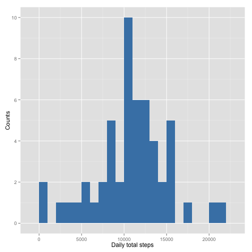
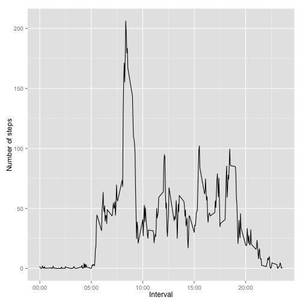
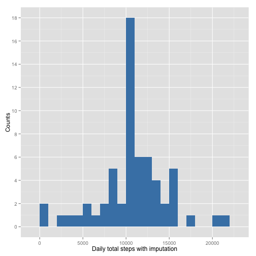
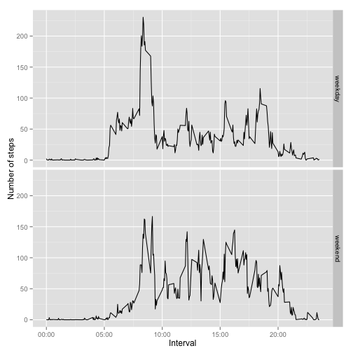

## I. Loading and preprocessing the data
1. Loading the data

Remeber to setwd() where the data is.

```r
library(dplyr)
library(ggplot2)
df <- read.csv("./activity.csv",  header = TRUE)
```

## II. What is mean total number of steps taken per day?

1. Make a histogram of the total number of steps taken each day.

I used  only complete cases for this part. I then calculated total number of steps taken each day with the following code.


```r
daily.sum <- df %>%
        filter(complete.cases(df)) %>%
        group_by(date) %>%
        summarize(daily.total.steps = sum(steps))
head(daily.sum)
```

```
## Source: local data frame [6 x 2]
## 
##         date daily.total.steps
## 1 2012-10-02               126
## 2 2012-10-03             11352
## 3 2012-10-04             12116
## 4 2012-10-05             13294
## 5 2012-10-06             15420
## 6 2012-10-07             11015
```

As, we can see, the dataframe "daily.sum" has column "date" and "daily.total.steps."
I then plotted the histogram of the "daily.total.steps."


```r
g <- ggplot(daily.sum, aes(x = daily.total.steps)) +
        geom_histogram(fill = "steelblue", binwidth = 1000)
g <- g + labs(x = "Daily total steps", y = "Counts") + 
        scale_y_continuous(breaks = seq(0, 10, by=2))
print(g)
```

 

2. Calculate and report the mean and median total number of steps taken per day

The mean and median was calculated with the code below.

```r
summarize(daily.sum, daily.step.mean = mean(daily.total.steps, na.rm = TRUE),
          daily.step.median = median(daily.total.steps))
```

```
## Source: local data frame [1 x 2]
## 
##   daily.step.mean daily.step.median
## 1           10766             10765
```
As we can see, the mean was 10766
          and median was
10765.


## III. What is the daily activity pattern?
1. Make a time series plot (i.e. type = "l") of the 5-minute interval (x-axis) and the average number of steps taken, averaged across all days (y-axis).

Here again, I used the complete cases and made a dataframe "interval.mean" that has two columns "interval" and its "mean.steps."


```r
interval.mean <- df %>%
        filter(complete.cases(df)) %>%
        group_by(interval) %>%
        summarize(mean.steps = mean(steps, na.rm = TRUE))
head(interval.mean)
```

```
## Source: local data frame [6 x 2]
## 
##   interval mean.steps
## 1        0    1.71698
## 2        5    0.33962
## 3       10    0.13208
## 4       15    0.15094
## 5       20    0.07547
## 6       25    2.09434
```

Then I plotted the graph.

```r
g2 <- ggplot(interval.mean, aes(x = interval, y = mean.steps)) + 
        geom_line() + 
        labs(x = "Interval", y = "Number of steps" ) +
        scale_x_continuous(breaks = c(0, 500, 1000, 1500, 2000), labels = c("00:00", "05:00", "10:00", "15:00", "20:00"))
print (g2)
```

 

2. Which 5-minute interval, on average across all the days in the dataset, contains the maximum number of steps?

From the following result, we can see the maximum number 206.2 was recorded at the interval 835 (08:35).

```r
interval.mean[which.max(interval.mean$mean.steps), "interval"]
```

```
## [1] 835
```

```r
max(interval.mean$mean.steps)
```

```
## [1] 206.2
```

## IV. Imputing missing values
1. Calculate and report the total number of missing values in the dataset (i.e. the total number of rows with NAs).

There are 2304 NA's in the dataset. This was obtained with the following code. 

```r
sum(is.na(df$steps))
```

```
## [1] 2304
```

2. Devise a strategy for filling in all of the missing values in the dataset. The strategy does not need to be sophisticated. For example, you could use the mean/median for that day, or the mean for that 5-minute interval, etc.

I imputed the mean number of steps of each 5-minute interval. This was calculated in Part III. as "interval.mean." 

3. Create a new dataset that is equal to the original dataset but with the missing data filled in.

Now, the original dataframe has three columns.

```r
head(df)
```

```
##   steps       date interval
## 1    NA 2012-10-01        0
## 2    NA 2012-10-01        5
## 3    NA 2012-10-01       10
## 4    NA 2012-10-01       15
## 5    NA 2012-10-01       20
## 6    NA 2012-10-01       25
```
I then joined the "df" and "interval.mean" with the key "interval." We see that new column "mean.steps" was added.

```r
## join df and interval.mean data with the key "interavl"
df <- left_join(df, interval.mean, by = "interval")
head(df)
```

```
##   steps       date interval mean.steps
## 1    NA 2012-10-01        0    1.71698
## 2    NA 2012-10-01        5    0.33962
## 3    NA 2012-10-01       10    0.13208
## 4    NA 2012-10-01       15    0.15094
## 5    NA 2012-10-01       20    0.07547
## 6    NA 2012-10-01       25    2.09434
```

Missing values were imputed by the following code.


```r
## impute the missing values with the values in mean.steps column
df$steps <- ifelse(is.na(df$steps), df$mean.steps, df$steps)
head(df)
```

```
##     steps       date interval mean.steps
## 1 1.71698 2012-10-01        0    1.71698
## 2 0.33962 2012-10-01        5    0.33962
## 3 0.13208 2012-10-01       10    0.13208
## 4 0.15094 2012-10-01       15    0.15094
## 5 0.07547 2012-10-01       20    0.07547
## 6 2.09434 2012-10-01       25    2.09434
```

We can confirm that the NA's in "steps" were imputed by "mean.steps."

The column "mean.steps" was no more necessary and was deleted for tidy. 

```r
## Delete mean.step for tidy.
df <- df[, -4]
```

4. Make a histogram of the total number of steps taken each day and calculate and report the mean and median total number of steps taken per day. Do these values differ from the estimates from the first part of the assignment? What is the impact of imputing missing data on the estimates of the total daily number of steps?

I calculated total number of steps taken each day in the same way as Part II. 1. This time I used imputed steps.


```r
daily.imputed.sum <- df %>%
        group_by(date) %>%
        summarize(daily.total.steps = sum(steps))
head(daily.imputed.sum)
```

```
## Source: local data frame [6 x 2]
## 
##         date daily.total.steps
## 1 2012-10-01             10766
## 2 2012-10-02               126
## 3 2012-10-03             11352
## 4 2012-10-04             12116
## 5 2012-10-05             13294
## 6 2012-10-06             15420
```

I then plotted the histogram of the "daily.total.steps."


```r
g3 <- ggplot(daily.imputed.sum, aes(x = daily.total.steps)) + 
        geom_histogram(fill = "steelblue", binwidth = 1000)
g3 <- g3 + labs(x = "Daily total steps with imputation", y = "Counts") + 
        scale_y_continuous(breaks = seq(0, 20, by=2))
print(g3)
```

 

Then the mean and median were calculated.

```r
summarize(daily.imputed.sum, daily.step.mean = mean(daily.total.steps, na.rm = TRUE),
          daily.step.median = median(daily.total.steps))
```

```
## Source: local data frame [1 x 2]
## 
##   daily.step.mean daily.step.median
## 1           10766             10766
```
The new mean was 10766 and the new median was 10766. These figures were almost the same as the ones obtained with the data before imputation in Part II. 2.

The comparison of the two histograms shows the significant difference in the peaks. The histogram with imputation shows almost twice as many concentration of counts at the mean step value in x-axis. 

I consider that the stability of the mean and median, and the concentration of counts were caused by the value of imputation: I used the mean number of the steps in each interval.

## V. Are there differences in activity patterns between weekdays and weekends?
1. Create a new factor variable in the dataset with two levels -- "weekday" and "weekend" indicating whether a given date is a weekday or weekend day.

I converted "date" column into Date class and added "day.of.the.week" column with weekday(). Then I added new column "day.type" that contain "weekend" and "weekday."

```r
df <- mutate(df, date=as.Date(date))
df <- mutate(df, day.of.the.week = weekdays(df$date))

df$day.type <- as.factor(ifelse((df$day.of.the.week == "Sunday" | df$day.of.the.week == "Saturday"), "weekend", "weekday"))
head(df)
```

```
##     steps       date interval day.of.the.week day.type
## 1 1.71698 2012-10-01        0          Monday  weekday
## 2 0.33962 2012-10-01        5          Monday  weekday
## 3 0.13208 2012-10-01       10          Monday  weekday
## 4 0.15094 2012-10-01       15          Monday  weekday
## 5 0.07547 2012-10-01       20          Monday  weekday
## 6 2.09434 2012-10-01       25          Monday  weekday
```

2. Make a panel plot containing a time series plot (i.e. type = "l") of the 5-minute interval (x-axis) and the average number of steps taken, averaged across all weekday days or weekend days (y-axis).

I created a new dataframe "interval.mean.day.type" that has three columns "day.type (weekend/weekday)", "interval" and "mean.steps.interval.day.type" that shows the mean step numbers categorized by "interval" and "day.type."

```r
interval.mean.day.type <- df %>%
        group_by(day.type, interval) %>%
        summarize(mean.steps.interval.day.type = mean(steps, na.rm = TRUE))
head(interval.mean.day.type)
```

```
## Source: local data frame [6 x 3]
## Groups: day.type
## 
##   day.type interval mean.steps.interval.day.type
## 1  weekday        0                      2.25115
## 2  weekday        5                      0.44528
## 3  weekday       10                      0.17317
## 4  weekday       15                      0.19790
## 5  weekday       20                      0.09895
## 6  weekday       25                      1.59036
```
Then I plotted the graph with the following code.

```r
g4 <- ggplot(interval.mean.day.type, aes(x = interval, y = mean.steps.interval.day.type)) + 
        geom_line() + facet_grid(day.type ~ .) +
        labs(x = "Interval", y = "Number of steps" ) +
        scale_x_continuous(breaks = c(0, 500, 1000, 1500, 2000), 
                           labels = c("00:00", "05:00", "10:00", "15:00", "20:00"))
print (g4)
```

 
